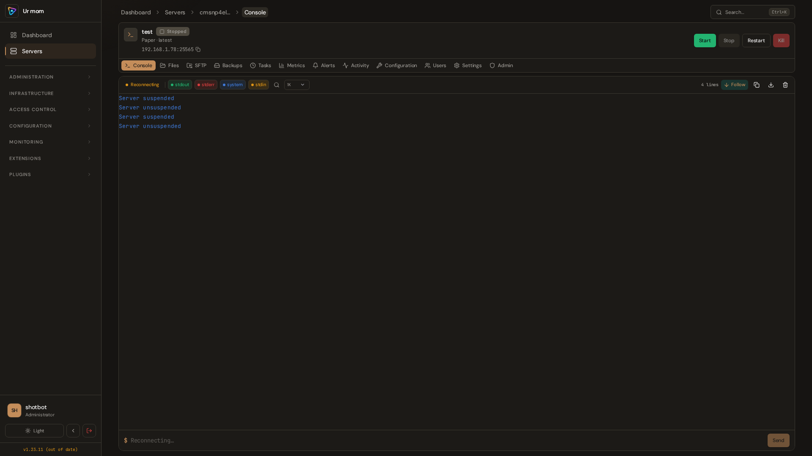
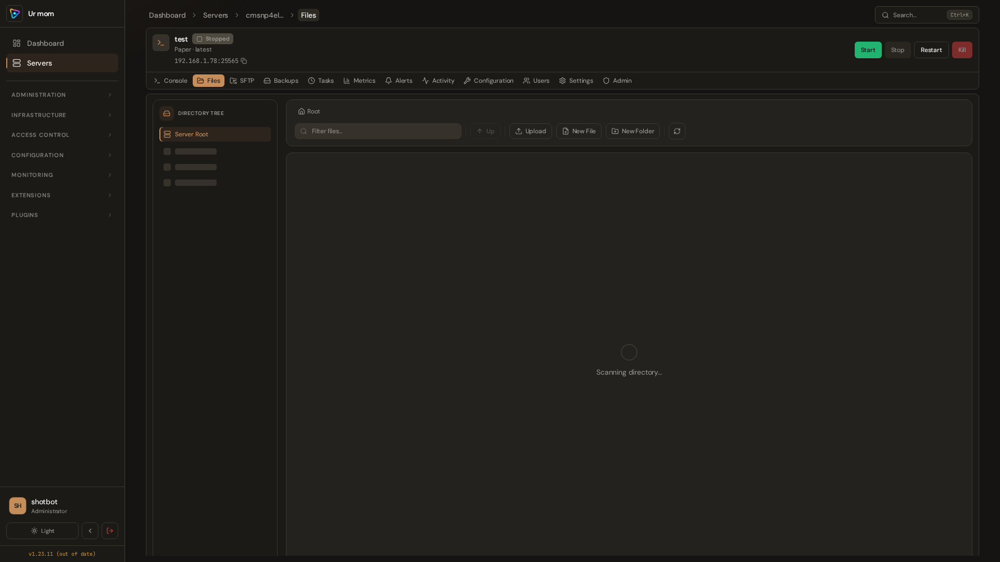
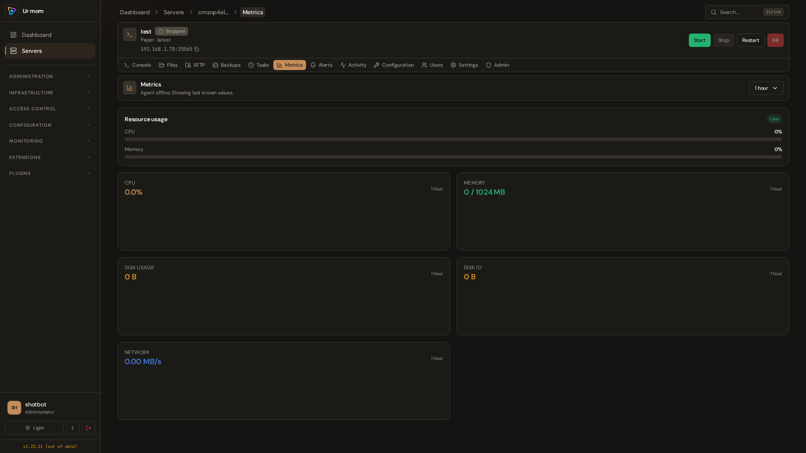
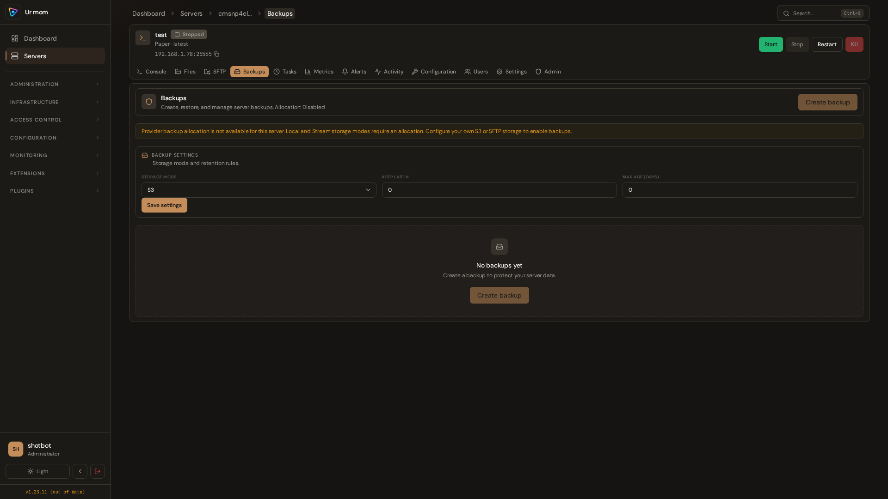
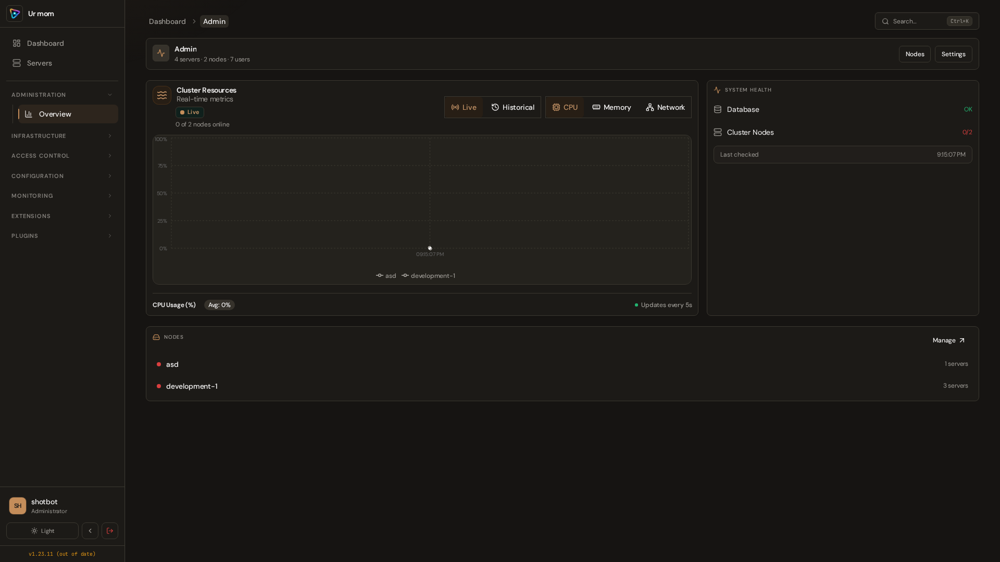

# Catalyst

    

**An experimental game server management platform in early testing.** Expect breaking changes and instability while core workflows are being validated.

> **Official support channels:** [GitHub Issues](https://github.com/catalystctl/catalyst/issues) and [Discord](https://discord.gg/mybxhmru3y). These are the only official lines of communication for support, bug reports, and project discussion.

---

## What is Catalyst?

Catalyst is a complete platform built for enterprise game server hosts, game communities, and billing panel integrations. Manage servers across multiple nodes with container isolation, live console access, automated backups, and fine-grained permissions.

🎯 **Perfect for:** Enterprise hosts, game communities, Minecraft/Rust/ARK/Hytale servers, billing panel automation

---

## ⚡ 5-Minute Quick Start

> **Docker Compose** (Docker or Podman) is the **only supported deployment method**. Everything runs in containers — no Node.js, Bun, or Rust install needed on the host.

### 1. Download & configure

```bash
VERSION=v1.56.3  # replace with the release you want
curl -fsSL -o install.sh "https://github.com/catalystctl/catalyst/releases/download/${VERSION}/install.sh"
curl -fsSL -o install.sh.sha256 "https://github.com/catalystctl/catalyst/releases/download/${VERSION}/install.sh.sha256"
sha256sum -c install.sh.sha256 && bash install.sh
cd catalyst-docker
nano .env          # Set PUBLIC_URL at minimum
docker compose up -d
```

### 2. Access the panel

Open your `PUBLIC_URL` in a browser. Complete the **Setup** wizard (admin account + appearance). That first setup user becomes the administrator and open registration is disabled afterward.

That's it. No build steps, no dependency installation, no manual secret generation (the install script does that for you).

👉 Want more detail? See the [Administrator Guide](https://docs.catalystctl.com/admin/overview/) for the full walkthrough, or [Installation](https://docs.catalystctl.com/admin/installation/) for every option and production hardening.

Stuck or have questions? Join the community on [Discord](https://discord.gg/mybxhmru3y) or open a [GitHub Issue](https://github.com/catalystctl/catalyst/issues).

---

## Installation Options

Catalyst deploys in three ways. Pick the one that fits you:

| Method | Time | Best For |
|--------|------|----------|
| **[One-Line Install](https://docs.catalystctl.com/admin/installation/)** | 5 minutes | First-time users, production |
| **[Docker/Podman Compose](https://docs.catalystctl.com/admin/installation/)** | 10 minutes | Users who want full control over TLS, ports, volumes |
| **[Build from Source](docs/development.md)** | 30+ minutes | Developers contributing to Catalyst |

### 🐳 Docker & Podman

Both Docker Compose and Podman Compose are fully supported. The workflow is identical — just replace `docker` with `podman` in every command.

```bash
# Docker
docker compose up -d

# Podman (drop-in replacement)
podman compose up -d
```

### 🔧 Configuration

All configuration lives in `.env`. The install script generates it automatically, but you can edit it anytime:

| Variable | Required | Default | Description |
|---|---|---|---|
| `PUBLIC_URL` | ✅ | — | The URL users access the panel from |
| `POSTGRES_PASSWORD` | ✅ | auto-generated | PostgreSQL password (URL-safe; generated by the install script) |
| `BETTER_AUTH_SECRET` | ✅ | auto-generated | Session encryption key |
| `REDIS_PASSWORD` | ✅ | auto-generated | Redis password (compose refuses to boot without it) |
| `BACKUP_CREDENTIALS_ENCRYPTION_KEY` | For stored credentials | auto-generated | Required to save S3/SFTP backup credentials and database passwords |
| `FRONTEND_PORT` | | `0.0.0.0:8080` (installed `.env`; bare compose fallback is `0.0.0.0:80`) | Panel port |
| `PORT` | | `80` | Port nginx listens on inside the frontend container (advanced; `FRONTEND_PORT` is what users need) |
| `BACKEND_PORT` | | `127.0.0.1:3000` | API port (localhost-only by default) |
| `BACKEND_INTERNAL_PORT` | | `3000` | Port the API listens on inside its container (advanced; the frontend nginx upstream and healthcheck follow it) |

> SFTP is served by the node agent (default port `2022`), not by the Docker stack.

For the complete variable reference, see [Environment Variables](docs/environment-variables.md).

### 🌐 Production & TLS

For production with automatic HTTPS:

```bash
# Caddy — automatic Let's Encrypt
docker compose -f docker-compose.yml -f docker-compose.caddy.yml up -d

# Or Traefik — Docker-native routing
docker compose -f docker-compose.yml -f docker-compose.traefik.yml up -d
```

See the [Administrator Guide](https://docs.catalystctl.com/admin/networking/) for full TLS, reverse proxy, and hardening details.

---

## Architecture

```
                     ┌─────────────────────┐
                     │   Docker Compose     │
                     │                      │
  :80 (panel)  ───► │  Nginx (Frontend)   │
                     │    │  /api  /ws      │
                     │    ▼                 │
                     │  Fastify (Backend)   │──► :3000 (API)
                     │    ▼                 │
  :5432 (internal) ◄─│  PostgreSQL          │
  :6379 (internal) ◄─│  Redis               │
                     └─────────────────────┘

  Game Nodes (separate machines):
  ┌──────────────┐                    ┌──────────────┐
  │  Rust Agent  │◄── WebSocket ─────►│  Backend API │
  │  (containerd)│                    └──────────────┘
  └──────┬───────┘
         │ :2022 (SFTP)
         ▼
  ┌──────────────┐
  │  Game        │
  │  Servers     │
  └──────────────┘
```

**Tech Stack:**

- **Backend:** TypeScript 6.0, Fastify, PostgreSQL, WebSocket Gateway
- **Frontend:** React 19, Vite, Catalyst Sync (csync), Radix UI
- **Agent:** Rust 1.95, Tokio, containerd gRPC
- **Features:** RBAC, SFTP, Plugin System, Task Scheduling, Alerts

👉 [Full architecture details](docs/architecture.md)

---

## Key Features

### 🎮 Complete Server Lifecycle

Create, start, stop, restart, and transfer servers with automatic crash detection and recovery.

### 📊 Real-Time Monitoring

Live console streaming via WebSockets (<10ms latency), resource metrics, and customizable alerts.

### 🔐 Enterprise Security

RBAC with 50+ granular permissions, API key authentication with rate limiting, audit logging, TLS support.

### 🔌 Powerful Plugin System

Extend functionality with custom backend plugins, API routes, WebSocket handlers, and scheduled tasks.

### 📁 File Management

Web-based file editor, SFTP access, upload/download with path validation, and automated backup/restore.

### 🤖 API-First Design

300+ REST endpoints with billing panel integration examples (WHMCS, Python, Node.js).

---

## Screenshots

All screenshots are captured automatically at 1080p via Playwright. [See how to regenerate them](catalyst-frontend/e2e/README.md).

### Authentication

| |
|---|
|  |
|  |
|  |

### User Panel

| |
|---|
|  |
|  |
|  |
|  |
|  |
|  |
|  |

### Admin Panel

| |
|---|
|  |
|  |
|  |
|  |
|  |
|  |
|  |
|  |
|  |
|  |
|  |

<details>
<summary>📁 View all screenshots (62 files)</summary>

#### Auth (5)
- [Login](docs/screenshots/auth/login.png) · [Register](docs/screenshots/auth/register.png) · [Forgot Password](docs/screenshots/auth/forgot-password.png) · [Reset Password](docs/screenshots/auth/reset-password.png) · [Invite](docs/screenshots/auth/invites-token.png)

#### User (34)
- [Dashboard](docs/screenshots/user/dashboard.png) · [Profile](docs/screenshots/user/profile.png) · [Servers](docs/screenshots/user/servers.png)
- [Server Console](docs/screenshots/user/server-test-tab-console.png) · [Files](docs/screenshots/user/server-test-tab-files.png) · [SFTP](docs/screenshots/user/server-test-tab-sftp.png)
- [Backups](docs/screenshots/user/server-test-tab-backups.png) · [Tasks](docs/screenshots/user/server-test-tab-tasks.png)
- [Metrics](docs/screenshots/user/server-test-tab-metrics.png) · [Alerts](docs/screenshots/user/server-test-tab-alerts.png) · [Mod Manager](docs/screenshots/user/server-test-tab-modmanager.png)
- [Plugin Manager](docs/screenshots/user/server-test-tab-pluginmanager.png) · [Configuration](docs/screenshots/user/server-test-tab-configuration.png) · [Users](docs/screenshots/user/server-test-tab-users.png)
- [Settings](docs/screenshots/user/server-test-tab-settings.png) · [Admin Tab](docs/screenshots/user/server-test-tab-admin.png) · [Activity](docs/screenshots/user/server-test-tab-activity.png)

#### Admin (23)
- [Dashboard](docs/screenshots/admin/admin.png) · [Users](docs/screenshots/admin/admin-users.png) · [Roles](docs/screenshots/admin/admin-roles.png)
- [Servers](docs/screenshots/admin/admin-servers.png) · [Nodes](docs/screenshots/admin/admin-nodes.png) · [Templates](docs/screenshots/admin/admin-templates.png)
- [Database](docs/screenshots/admin/admin-database.png) · [System](docs/screenshots/admin/admin-system.png)
- [Security](docs/screenshots/admin/admin-security.png) · [Theme Settings](docs/screenshots/admin/admin-theme-settings.png) · [Alerts](docs/screenshots/admin/admin-alerts.png)
- [Audit Logs](docs/screenshots/admin/admin-audit-logs.png) · [API Keys](docs/screenshots/admin/admin-api-keys.png) · [Plugins](docs/screenshots/admin/admin-plugins.png)
- [Node Details](docs/screenshots/admin/node-development-1.png) · [Node Allocations](docs/screenshots/admin/node-development-1-allocations.png)
- [Minecraft Template](docs/screenshots/admin/template-minecraft-server-universal.png) · [Node.js Template](docs/screenshots/admin/template-node-js-bot-git-repository.png)


</details>

---

## What Makes Catalyst Different?

- **containerd** for superior performance (not Docker)
- **WebSocket gateway** for real-time communication (<10ms latency)
- **Plugin system** for infinite extensibility
- **Rust agent** for memory safety and performance
- **Docker Compose** for one-command deployment

---

## Documentation

Full product documentation lives at **[docs.catalystctl.com](https://docs.catalystctl.com)**
([source](https://github.com/catalystctl/catalyst-doc)):

| Guide | For You If... | Start here |
|-------|---------------|------------|
| **[Getting Started](https://docs.catalystctl.com/getting-started/first-server/)** | New to Catalyst | First server in minutes |
| **[Game Server Guide](https://docs.catalystctl.com/users/overview/)** | Server owner | Console, files, backups, databases, tasks |
| **[Administrator Guide](https://docs.catalystctl.com/admin/overview/)** | System operator | Install, nodes, networking, updates |
| **[API & Developers](https://docs.catalystctl.com/api/overview/)** | Developer | Auth, WebSockets, generated API reference |
| **[Troubleshooting](https://docs.catalystctl.com/troubleshooting/overview/)** | All | Errors, fixes, debugging workflows |

Contributor and engineering references stay in this repo under [`docs/`](docs/README.md):
[Agent Guide](docs/agent.md) · [Architecture](docs/architecture.md) ·
[Development](docs/development.md) · [Plugin System](docs/plugins.md) ·
[Environment Variables](docs/environment-variables.md) · [Security](docs/SECURITY.md)

---

## Project Status

| Category | Status |
|----------|--------|
| Core Features (Servers, Nodes, Backups, SFTP) | ✅ Stable |
| Security (RBAC, Audit, TLS, API Keys) | ✅ Stable |
| REST API | ✅ 300+ endpoints across 26 route modules |
| Real-Time (WebSocket Console, Metrics) | ✅ Stable |
| Frontend UI | ✅ 30+ pages, full admin panel |
| Plugin System | ✅ Stable (6 bundled plugins) |
| Task Scheduling | ✅ Stable |
| Alerting | ✅ Stable |
| Agent (Rust, containerd) | ✅ Stable |
| Testing | ✅ 58 backend test files, 3 Playwright E2E suites |
| Container Deployment | ✅ Docker Compose, Podman Compose |
| v2 (Scaling, CLI, Mobile) | 🔮 Planned |

---

## 📚 Quick Documentation Links

New here? Pick your path in the [documentation](https://docs.catalystctl.com):

- 🚀 **[First server](https://docs.catalystctl.com/getting-started/first-server/)** — Running in minutes
- 📖 **[Installation](https://docs.catalystctl.com/admin/installation/)** — Every option, every edge case, production hardening
- 🐳 **[Networking & TLS](https://docs.catalystctl.com/admin/networking/)** — Reverse proxy, TLS, ports

The full documentation catalog is in the table above.

---

## Support & Community

**Official support channels are GitHub Issues and Discord only.** Please use these for bug reports, feature requests, installation help, and project discussion — they are our official lines of communication.

| Channel | Use for |
|---------|---------|
| **[GitHub Issues](https://github.com/catalystctl/catalyst/issues)** | Bug reports, feature requests, tracked work |
| **[Discord](https://discord.gg/mybxhmru3y)** | Real-time help, community discussion, announcements |

Invite link: [https://discord.gg/mybxhmru3y](https://discord.gg/mybxhmru3y)

---

## Contributing

We welcome contributions! Please see [CONTRIBUTING.md](CONTRIBUTING.md) for repository guidelines, code conventions, and commit standards.

Questions about contributing? Hop into [Discord](https://discord.gg/mybxhmru3y) or open a [GitHub Issue](https://github.com/catalystctl/catalyst/issues).

---

## License

GPLv3 © 2026 Catalyst Contributors
